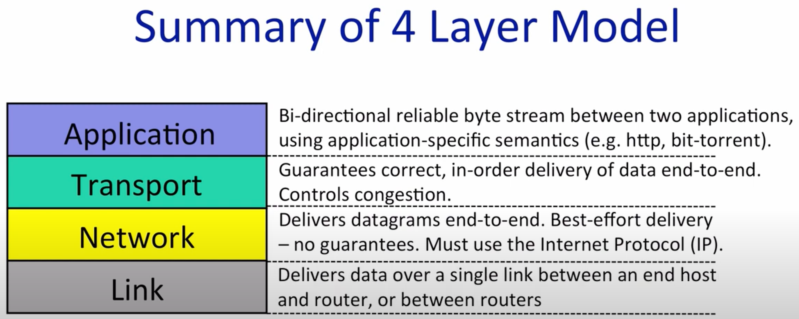
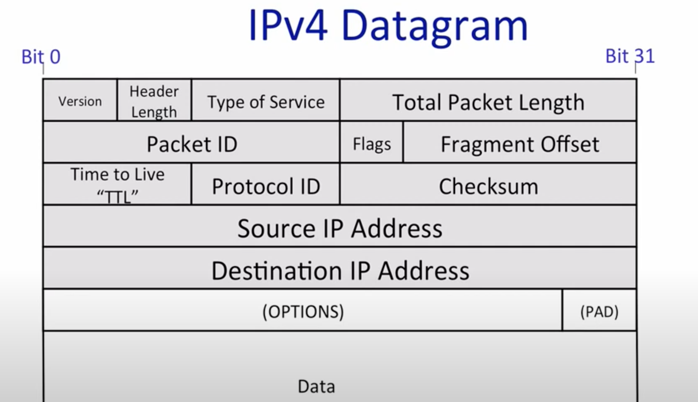

# CS144 Introduction to Computer Networking

`next`: https://www.youtube.com/watch?v=qNSIIRxEhZI&list=PL6RdenZrxrw9inR-IJv-erlOKRHjymxMN&index=20

分层结构，网络传输时从上至下依次调用，主机之间仅同层交流，同一主机内仅上下层交流。

- Application：http，smtp，ssh，ftp
- Transport：TCP，UDP，RTP
- Network：IP
- Link：Ethernet，WiFi，DSL，3G

### IP Service Model

| Property | Behavior |
| :--: | :--: |
| Datagram | Individually routed packets. Hop-by-hop routing. |
| Unreliable | Packets might be dropped |
| Best effort | Only drop datagrams only if necessary |
| Connectionless | No per-flow state. Packets might be mis-sequenced |

1. Tries to prevent packets looping forever using `ttl`. If it exceeds 128 (default), then we think it might be stuck in a loop and just drop it.
2. Will fragment packets if they are too long because of the limit of link layer.
3. Uses a header checksum to reduce chances of delivering datagram to wrong destination.
4. Allows for new versions of IP, such as IPV6.
5. Allows for new options to be added to header.

