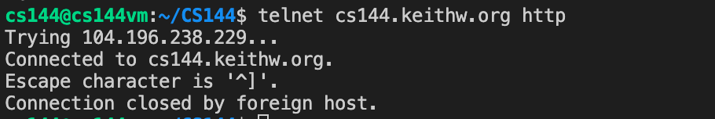
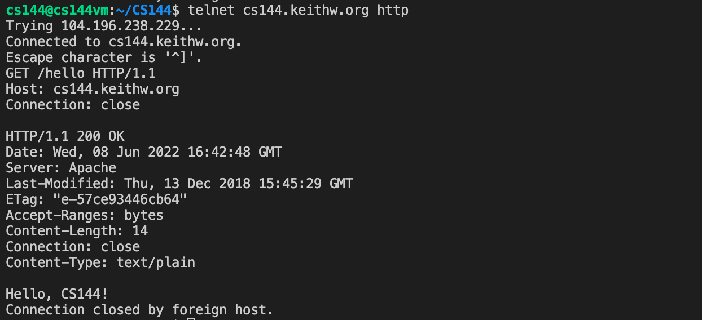
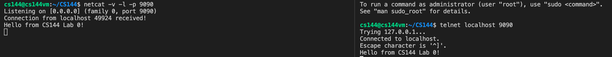
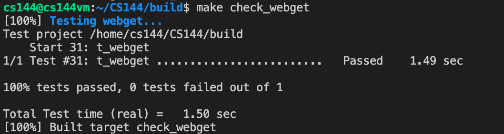
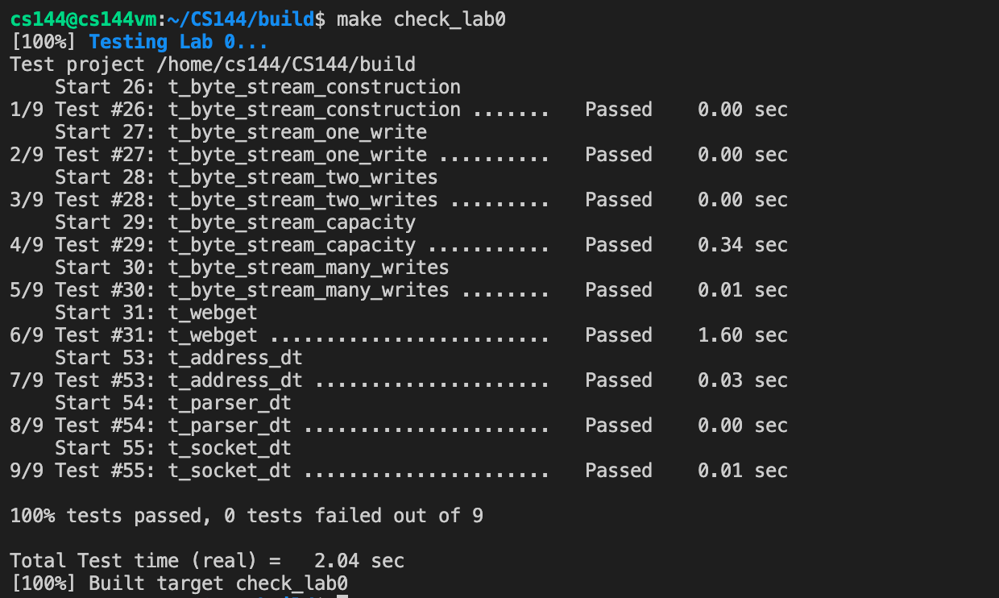

# Lab Checkpoint 0: networking warmup

## Content

- [Set up GNU/Linux on your computer](#Set up GNU/Linux on your computer)
- [Networking by hand](#Networking by hand)
	- [Fetch a Web page](#Fetch a Web page)
	- [Send yourself an email](#Send yourself an email)
	- [Listening and connecting](#Listening and connecting)
- [Writing a network program using an OS stream socket](#Writing a network program using an OS stream socket)
	- [Writing webget](#Writing webget)
	- [An in-memory reliable byte stream](#An in-memory reliable byte stream)

## Set up GNU/Linux on your computer

Follow the [instruction page](https://stanford.edu/class/cs144/vm_howto/vm-howto-image.html) step by step. Use VirtualBox instead of VM Fusion to set up your virtual machine.

You can get access to the virtual machine using the following command

```bash
$ ssh -p 2222 cs144@localhost
```

and I use VS Code to connect to it and coding.

## Networking by hand

### Fetch a Web page

On my VM, run `telnet cs144.keithw.org http` and I can get the following output.



Then, run following commands in order:

```bash
$ GET /hello HTTP/1.1
$ Host: cs144.keithw.org
$ Connection: Close
```

and you will see `Hello, CS144!`.



### Send yourself an email

Because I'm not the student of Stanford University, so I would like to use 163 mail for substitution.

First of all, I have to login to 163 email and open the smtp service. Then I use my shell to connect to it.

```bash
$ telnet smtp.163.com 25
Trying 123.126.97.113...
Connected to smtp.163.com.
Escape character is '^]'
220 163.com Anti-spam GT for Coremail System (163com[20141201])
```

After that, I should login to my account using my email and token (which you can get when you open the smtp service). Remember to encode it to base64 fro [here](https://tool.ip138.com/base64/).

```bash
> HELO localhost
250 OK
> auth login
334 dXNlcm5hbWU6
> **** (something like xxxx@163.com to encode to base64)
334 UGFzc3dvcmQ6
> **** (password to encode to base64)
235 Authentication successful
```

Now I type `data` to write my email content and finish it with `.`.

```bash
> data
354 End data with <CR><LF>.<CR><LF>
> From: xxxx@163.com
> To: xxx@qq.com
> Subject: Hello from CS144 Lab 0!
> .
250 Mail OK queued as smtp1,GdxpCgBHzJzzUqFiJ2sQHQ--.26520S4 1654739914
> QUIT
221 Bye
```

Check your sender email's sendbox and your receiver email's inbox, and you will find it.

### Listening and connecting

Running a server first and leave it.

```bash
$ netcat -v -l -p 9090
Listening on [0.0.0.0] (family 0, port 9090)
```

Running a client to connect to the server.

```bash
$ telnet localhost 9090
Trying 127.0.0.1...
Connected to localhost.
Escape character is '^]'.
```

And you will also see something like `Connection from localhost 49924 received!` in the server.

After that, you can type everything you like in either of the server and the client. And you can see the same content in another.



## Writing a network program using an OS stream socket

Build the whole program first.

```bash
$ mkdir build
$ cd build
$ cmake ..
$ make -j4
```

Here are some useful commands.

```bash
$ make check_labN *(replacing N with a checkpoint number)*
$ make format # need `clang-format`
$ make help # see all available targets
```

### Writing webget

We should only modify `/apps/webget.cc` to finish this part.

Following the instruction, we should first connect to the host, and then send something like `GET /hello HTTP/1.1` to it. Don't forget to add `\r\n` to every line you write into the connection.

```C++
const string service = "http";
Address addr(host, service);
TCPSocket sock;

sock.connect(addr);
sock.write("GET " + path + " HTTP/1.1");
sock.write("Host: " + host + "\r\n");
sock.write("Connection: close\r\n");
sock.write("\r\n");
```

Then, we can read until we reach the "eof".

```C++
while (!sock.eof()) {
	auto recvd = sock.read();
	cout << recvd;
};
```

Finally, close the socket.

```C++
sock.close();
```



### An in-memory reliable byte stream

The basic function of the class `ByteStream` is `write()` and `read()`. So I use a `std::string` variable `bytestream` to simulate the buffer. And the buffer has a maximum capacity which is store in `cap`. I use `bytesread/byteswritten` to record the total number of bytes written/popped. `endin` indicates whether the stream input has ended or not.

```C++
class ByteStream {
	private:
		std::string bytestream{};
		size_t cap{};
		size_t bytesread{};
		size_t byteswritten{};
		bool endin{};
}
```

I was asked to initial the class variable in an initialization list.

```C++
ByteStream::ByteStream(const size_t capacity) : cap{capacity}, bytesread{0}, byteswritten{0}, endin{false} {}
```

Every time I write data, I should check out if the remaining capacity is enough for me to write the whole data into the buffer. If not, I should only write remaining capacity characters and just discard others.

```C++
size_t ByteStream::write(const string &data) {
    size_t rmn_cap = this->remaining_capacity();
    size_t writebytes = rmn_cap < data.size() ? rmn_cap : data.size();

    this->bytestream.append(data.substr(0, writebytes));
    this->byteswritten += writebytes;
    return writebytes;
}
```

I can get remaining capacity by simply substracting capacity from the number of characters in the buffer.

```C++
size_t ByteStream::remaining_capacity() const { return this->cap - this->bytestream.size(); }
```

Make `endin` become `True` for ending input.

```C++
void ByteStream::end_input() { this->endin = true; }
```

And now I come to reading. Function `peek_output()` confuses me a lot until I dived into the test source file. To be brief, it just output the first `len` characters in the buffer but don't pop them out of the buffer.

```C++
string ByteStream::peek_output(const size_t len) const { return this->bytestream.substr(0, len); }
```

And every time I pop something out of buffer, I should erase them and add `bytesread` as well.

```C++
void ByteStream::pop_output(const size_t len) {
    this->bytestream.erase(0, len);
    this->bytesread += len;
}
```

Function `read()` is a wrapper of `pop_output()`, which should also return the popped content to the user.

```C++
std::string ByteStream::read(const size_t len) {
    std::string ans = this->bytestream.substr(0, len);
    pop_output(len);
    return ans;
}
```

There are also some tiny functions such as `eof()`, `buffer_size()` and etc.. which can be implemented easily.

```C++
bool ByteStream::input_ended() const { return this->endin; }
bool ByteStream::eof() const { return input_ended() && buffer_empty(); }
size_t ByteStream::buffer_size() const { return this->bytestream.size(); }
bool ByteStream::buffer_empty() const { return this->bytestream.empty(); }
size_t ByteStream::bytes_written() const { return this->byteswritten; }
size_t ByteStream::bytes_read() const { return this->bytesread; }
```

Finally, I implement the whole lab and get `100/100` grade.




