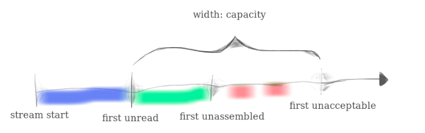
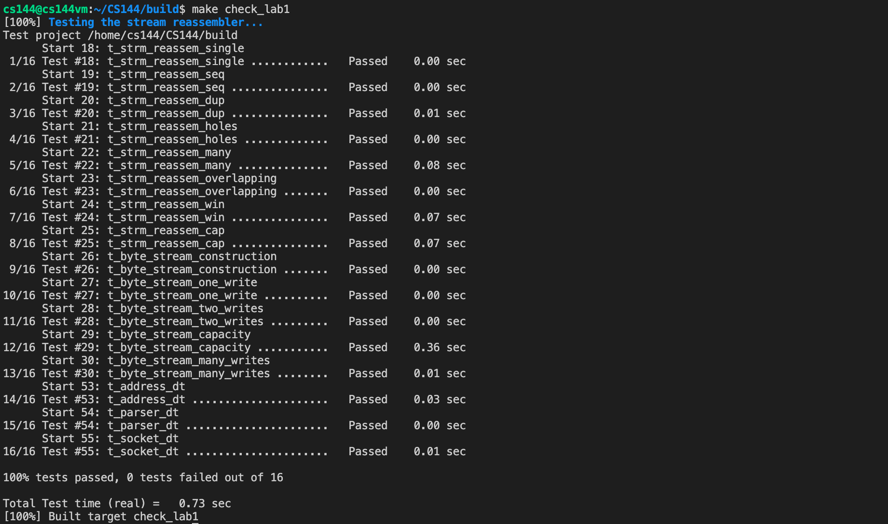

# Lab Checkpoint 1: stitching substrings into a byte stream

## Content

- [Getting started](#Getting started)
- [Putting substrings in sequence](#Putting substrings in sequence)

## Getting started

Make sure to commit all my solutions to Lab 0 and fetch Lab 1 from upstream. Don't forget to merge Lab 0.

```bash
$ git fetch
$ git checkout -b lab1 origin/lab1-startercode
$ git merge lab0
$ git push origin HEAD:origin/lab1-startercode
```

## Putting substrings in sequence

Generally speaking, this lab asks me to **reassemble the substring coming unorderly and overlapped** with the limit of memory usage (capacity). We should discard some substrings if the memory we use exceeds the capacity. Here is my architecture of class `StreamReassmbler`. I define the struct `substring` to store the unassembled bytes.



```C++
class StreamReassembler {
	private:
    ByteStream _output;     //!< The reassembled in-order byte stream
    size_t _capacity{};     //!< The maximum number of bytes
    uint64_t _nextbyte{};   // the index of next byte to write into ByteStream
    bool _eof{};            // whether the end of file
    uint64_t _end_index{};  // the end index

    struct substring {
        // index_begin <= data index in the stream < index_end
        std::string data{};
        uint64_t index{};
        bool eof{};
        substring(){};
        substring(const std::string &d, uint64_t i, bool e) : data{d}, index{i}, eof{e} {};
    };
    std::vector<substring> _substrings{};

    void discard_substrings();  // discard substring exceed the memory limit
    void merge_substrings();    // merge substring if they are overlapped
    void write_substrings();    // write substring into _output as much as we can
}
```

`push_substring()` is the core of the class `StreamReassembler`. Whenever accepting a substring of bytes, I will compare its index with `_nextbyte` which indicates the next index `_output` needs.

If `_nextbyte` is greater or equal to the coming substring's end index, we should just ignore it because we already have it.

Else if `_nextbyte` is between the coming substring's begin index and end index, we should cut the coming substring and write it directly into the `_output`. Then check out if there is something in `_substrings` we can use to write into `_output`.

Else if `_nextbyte` is less than the coming substring's begin index, which means the coming substring will not used currently and might be stored into `_substrings`.

```C++
//! \details This function accepts a substring (aka a segment) of bytes,
//! possibly out-of-order, from the logical stream, and assembles any newly
//! contiguous substrings and writes them into the output stream in order.
void StreamReassembler::push_substring(const string &data, const size_t index, const bool eof) {
    size_t index_begin = index, index_end = index + data.size();
    if (eof) {
        _eof = true;
        _end_index = index_end;
    };

    // already have read it or store it in the ByteStream
    // simply discard it
    if (_nextbyte >= index_end) {
    } else if (index_begin <= _nextbyte && _nextbyte < index_end) {
        // directly write it into the ByteStream as much as we can
        const size_t writebytes = _output.write(data.substr(_nextbyte - index_begin));
        _nextbyte += writebytes;

        write_substrings();
    } else if (_nextbyte < index_begin) {
        // insert and combine the part into the _substrings, find the correct position to insert
        auto iter = _substrings.begin();
        while (iter != _substrings.end()) {
            if (iter->index >= index_begin)
                break;
            else
                iter++;
        };

        _substrings.insert(iter, substring(data, index, eof));
    };

    merge_substrings();
    discard_substrings();
    if (empty())
        _output.end_input();
    return;
}
```

`write_substrings()` tries to find substring which can write into the `_output`. This function is called whenever `_output` is flushed by the newly added bytes.

```C++
void StreamReassembler::write_substrings() {
    while (!_substrings.empty()) {
        auto iter = _substrings.begin();
        size_t idx_begin = iter->index, idx_end = iter->index + iter->data.size();
        if (_nextbyte >= idx_end)
            _substrings.erase(iter);
        else if (_nextbyte < idx_begin)
            break;
        else {
            // just regard the piece as a incoming part and reuse the function to handle it
            const size_t writebytes = _output.write(iter->data.substr(_nextbyte - idx_begin));
            _nextbyte += writebytes;
            _substrings.erase(iter);
        };
    };
}
```

`merge_substrings()` tries to merge two substring in `_substrings` if they have bytes overlapped. It's easy to judge overlap by the index.

```C++
void StreamReassembler::merge_substrings() {
    auto iter_prev = _substrings.begin(), iter_next = iter_prev;
    if (iter_next != _substrings.end())
        ++iter_next;

    while (iter_next != _substrings.end()) {
        uint64_t prev_end = iter_prev->index + iter_prev->data.size();
        uint64_t next_begin = iter_next->index, next_end = iter_next->index + iter_next->data.size();
        // prev_begin <= next_begin < next_end <= prev_end
        if (next_end <= prev_end)
            iter_next = _substrings.erase(iter_next);
        else if (next_begin <= prev_end) {
            // prev_begin <= next_begin <= prev_end < next_end
            iter_prev->data.append(iter_next->data.substr(prev_end - next_begin));
            iter_next = _substrings.erase(iter_next);
        } else {
            // not overlap
            iter_prev++;
            iter_next++;
        };
    };
    return;
}
```

`discard_substrings()` tries to discard the substring until the memory I use fulfils the requirements of `_capacity`.

```C++
void StreamReassembler::discard_substrings() {
    // discard the part exceeding the capacity
    size_t rmn_cap = _output.remaining_capacity(), uabd_bytes = unassembled_bytes();
    while (uabd_bytes > rmn_cap) {
        auto iter = _substrings.rbegin();
        if (uabd_bytes - rmn_cap >= iter->data.size()) {
            // directly discard the whole piece
            _substrings.pop_back();
            uabd_bytes -= iter->data.size();
        } else {
            // discard part of the piece
            iter->data.erase(iter->data.begin() + uabd_bytes - rmn_cap);
            uabd_bytes = rmn_cap;
            break;
        };
    };
}
```

Whenever you grades, please make sure your VPN is closed. Otherwise, there might be some test cases running out of time.


