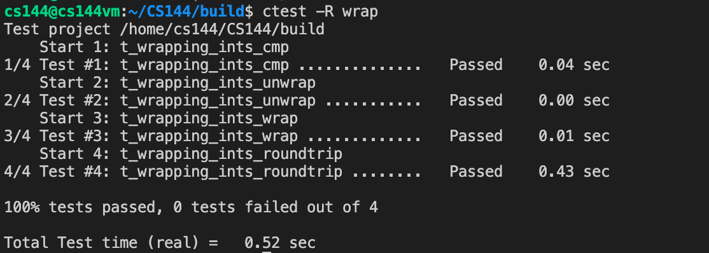

# Lab Checkpoint 2: the TCP receiver

## Content

- [Translating between 64-bit indexes and 32-bit seqnos](#Translating between 64-bit indexes and 32-bit seqnos)
- [Implementing the TCP receiver](#Implementing the TCP receiver)

## Translating between 64-bit indexes and 32-bit seqnos

Because of the following three complexities, we should wrap the 32-bit sequence numbers as a class.

- Your implementation needs to plan for 32-bit integers to wrap around.
- TCP sequence numbers start at a random value.
- The logical beginning and ending each occupy one sequence number.


`wrap()` mainly **converts absolute seqno to (relative) seqno**. Specifically, given an absolute sequence number `n` and an Initial Sequence Number `isn`, produce the (relative) sequence number for `n`.

$$
\text{seqno} = \text{isn} + \text{n} \bmod (2 ^ {32})
$$

As for coding, I use a mask to discard high bits.

```C++
WrappingInt32 wrap(uint64_t n, WrappingInt32 isn) {
  uint32_t raw_value = n & 0xFFFFFFFF;  // n % (2 ^ 32)
  return isn + raw_value;
}
```

`unwrap()` transforms a `WeappingInt32` into an "absolute" 64-bit sequence bumber (zero-indexed) which is much harder. 

```C++
uint64_t unwrap(WrappingInt32 n, WrappingInt32 isn, uint64_t checkpoint) {
	uint64_t val = static_cast<uint64_t>(n - isn) & 0xFFFFFFFF;

  // (2 ^ 32) * x + val ~ checkpoint
  if (val >= checkpoint)
  return val;

  int32_t x = static_cast<int32_t>((checkpoint - val) >> 32);
  uint64_t ans = val, minus = val >= checkpoint ? val - checkpoint : checkpoint - val;
  for (int32_t i = x - 1; i <= x + 1; i++) {
  	// check out every possible val
    uint64_t pos_ans = (1ul << 32) * static_cast<uint64_t>(i) + val;
    uint64_t pos_minus = pos_ans >= checkpoint ? pos_ans - checkpoint : checkpoint - pos_ans;
    if (pos_minus < minus) {
      minus = pos_minus;
      ans = pos_ans;
    };
  };

  return ans;
}
```

We can use `ctest -R wrap` to judge the correctness of this part, and use `ctest -R wrap --debug` to debug (print more infomation to the screen).



## Implementing the TCP receiver


We should record the initial sequence number and next sequence number.

```C++
  //! Our data structure for re-assembling bytes.
  StreamReassembler _reassembler;

  //! The maximum number of bytes we'll store.
  size_t _capacity{};

  std::optional<WrappingInt32> _init_seqno;
  std::optional<WrappingInt32> _next_ackno;
  bool _syn_received;
```

When we receive a TCP segment, if we don't get SIN ever and this segment don't contains SIN, then we should just ignore the segment.

We should only get the first SIN as well. The second, the third ... should be ignored.

We can just substract one to convert absolute seqno to stream index and don't forget to evaluate `_next_ackno`.

```C++
void TCPReceiver::segment_received(const TCPSegment &seg) {
  // set the initial sequence number if necessary
  if (seg.header().syn) {
    // just accept the first syn
    if (_syn_received)
      return;

    _syn_received = true;
    // init `_init_seqno` and `_next_ackno`
    _init_seqno.emplace(seg.header().seqno);
    _next_ackno.emplace(_init_seqno.value() + 1);
  };

  if (_syn_received) {
    // push substring into StreamReassembler
    const std::string data = seg.payload().copy();
    const uint64_t stream_index =
      unwrap(seg.header().seqno + seg.header().syn, _init_seqno.value(), _reassembler.get_abs_seqno()) - 1;
    const bool eof = seg.header().fin;
    _reassembler.push_substring(data, stream_index, eof);
    // evaluate next ackno
    _next_ackno.emplace(wrap(_reassembler.get_abs_seqno(), _init_seqno.value()) + 1);

    if (_reassembler.empty())
      _next_ackno.emplace(_next_ackno.value() + 1);
  };
}
```

`ackno()` and `window_size()` are easier.

```C++
optional<WrappingInt32> TCPReceiver::ackno() const { return _next_ackno; }
size_t TCPReceiver::window_size() const { return _capacity - _reassembler.stream_out().buffer_size(); }
```

Then, judge it and make it.

```bash
$ make -j 4
$ make check_lab2
```


