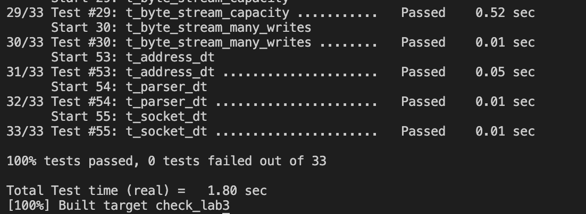

# Lab Checkpoint 3: the TCP sender

## Content

- [Retransmission Timer](#Retransmission-Timer)
- [Implementing the TCP sender](#Implementing-the-TCP-sender)


## Retransmission Timer

Retransmission timer is an alarm that can be started at a certain time, and goes off (or "expires") once the RTO has elapsed. So I implement it as `TCPTimer` class and provide counting time functions such as `start()` or `is_expired()`.

```C++
//! TCP Retransmission Timer
class TCPTimer {
  private:
    //! whether the timer is running
    bool _is_running;

    //! microseconds since the timer started, reset to zero when the timer starts or restarts
    size_t _ms_since_started;

    //! retransmission timer for the connection currently
    size_t _current_retransmission_timeout;

  public:
    TCPTimer(size_t initial_retransmission_timeout) : _is_running{false}, _ms_since_started{0}, _current_retransmission_timeout{initial_retransmission_timeout} {};

    bool is_running() const {
      return _is_running;
    };

    void start(size_t initial_retransmission_timeout) {
      _is_running = true;
      _ms_since_started = 0;
      _current_retransmission_timeout = initial_retransmission_timeout;
    };

    void restart() {
      _ms_since_started = 0;
    };

    void stop() {
      _is_running = false;
    };

    void add(size_t ms_since_last_tick) {
      _ms_since_started += ms_since_last_tick;
    };

    bool is_expired() const {
      return _is_running && (_ms_since_started >= _current_retransmission_timeout);
    };

    void double_rto() {
      _current_retransmission_timeout <<= 1;
    };

    void reset_rto(size_t initial_retransmission_timeout) {
      _current_retransmission_timeout = initial_retransmission_timeout;
    };

    size_t get_rto() const {
      return _current_retransmission_timeout;
    };
};
```

## Implement the TCP sender

`fill_window()` reads from its input `ByteStream` and sends as many bytes as possible in the form of `TCPSegments`, _as long as there are new bytes to be read and space acailable in the window_.

Be careful that the `fill_window()` method should act like the window size is **one** if the window size is zero.

Don't be too nervous in the first implementation. There are many specific tests to help you improve the details so you can just implement it, test it and improve it in a loop.

```C++
void TCPSender::fill_window() {
    // if the window size is zero, act like the window size is one
    // send a single byte that gets rejected by the receiver
    size_t assumed_window_size = max(_window_size, 1U);

    // reads from ByteStream and sends as many bytes as possible in the form of TCPSegments
    // as long as there are new bytes to be read and spce available in the window
    while (_next_seqno - _ackno < assumed_window_size) {
        TCPSegment tcp_segment_to_send;
        if (!_syn_sent)
            _syn_sent = tcp_segment_to_send.header().syn = true;
        
        tcp_segment_to_send.header().seqno = _isn + _next_seqno;
        
        size_t free_window_size = assumed_window_size - (_next_seqno - _ackno);
       
        // data len should be no more than free window size, no more than MAX_PAYLOAD_SIZE, no more than the number of bytes we have now
        size_t data_len = min(free_window_size - tcp_segment_to_send.length_in_sequence_space(), TCPConfig::MAX_PAYLOAD_SIZE);
        data_len = min(data_len, _stream.buffer_size());
        
        // don't add FIN if this would make the segment exceed the receiver's window
        if (_stream.input_ended() && !_fin_sent && free_window_size > data_len)
            _fin_sent = tcp_segment_to_send.header().fin = true;

        std::string data = _stream.read(data_len);
        Buffer buffer(std::move(data));
        tcp_segment_to_send.payload() = buffer;
        // if the segment contains data, send it
        if (tcp_segment_to_send.length_in_sequence_space() > 0) {
            _segments_out.push(tcp_segment_to_send);
            _segments_outstanding.push_back(tcp_segment_to_send);

            // start retransmission running
            if (!_retransmission_timer.is_running() && _window_size)
                _retransmission_timer.start(_initial_retransmission_timeout);

            _next_seqno += tcp_segment_to_send.length_in_sequence_space();

            // if there is no other input, break the loop
            if (_stream.buffer_empty())
                break;
        } else break;
    };
}
```

`ack_received()` is called when a segment is received from the receiver, conveying the new left (= `ackno`) and right (= `ackno + window size`) edges of the window. The TCPSender should look through its collection of outstanding segments and remove any that have now been fully acknowl- edged (the ackno is greater than all of the sequence numbers in the segment). The TCPSender should fill the window again if new space has opened up. Again, you don't need to consider too many details in the first implementation, because you can fix it through tests.

```C++
//! \param ackno The remote receiver's ackno (acknowledgment number)
//! \param window_size The remote receiver's advertised window size
void TCPSender::ack_received(const WrappingInt32 ackno, const uint16_t window_size) {
    // evaluate window size 
    _window_size = window_size;
    // ignore impossible ackno (beyond next seqno) 
    if (unwrap(ackno, _isn, _next_seqno) > _next_seqno)
        return;
    // if ackno is greater than any previous ackno
    if (unwrap(ackno, _isn, _next_seqno) > _ackno) {
        // remove any that have now been fully acknowledged outstanding segments
        _ackno = unwrap(ackno, _isn, _next_seqno);

        // remove any fully acked outstanding segments
        _remove_acked_outstanding_segments();
        // fill the window again if new space has opened up
        fill_window();
        // set the RTO back to its initial value
        _retransmission_timer.reset_rto(_initial_retransmission_timeout);
        // if the sender has any outstanding data, restart the retransmission timer
        if (!_segments_outstanding.empty())
            _retransmission_timer.start(_initial_retransmission_timeout);
        // reset the count of `consecutive retransmissions` back to zero
        _count_consecutive_retransmissions = 0;
    };
}
```

`tick()` will be called if time has passed a certain number of milliseconds. This method will use class `TCPTimer` as the timer.

```C++
//! \param[in] ms_since_last_tick the number of milliseconds since the last call to this method
void TCPSender::tick(const size_t ms_since_last_tick) {
    // retransmit the earliest segment that hasn't been fully ack by the TCP receiver
    _retransmission_timer.add(ms_since_last_tick);
    if (_retransmission_timer.is_expired()) {
        // find the earliest (lowest sequence number) segment and resend it
        if (!_segments_outstanding.empty()) {
            uint64_t lsn = UINT64_MAX;
            TCPSegment earliest_segment;
            for (const TCPSegment& tcp_segment : _segments_outstanding) {
                uint64_t seqno = unwrap(tcp_segment.header().seqno, _isn, _next_seqno);
                if (seqno < lsn) {
                    lsn = seqno;
                    earliest_segment = tcp_segment;
                };
            };
            _segments_out.push(earliest_segment);
        };
        // If the window size is nonzero,
        if (_window_size > 0) {
            // increment the number of consecutive retransmissions, this will be used by TCPConnection
            _count_consecutive_retransmissions++;
            // double the value of RTO
            _retransmission_timer.double_rto();
        };
        // reset the retransmission timer and start it
        _retransmission_timer.start(_retransmission_timer.get_rto());
    };
}
```

And some other functions are much more easy to complete, which are not being mentioned in the document.



